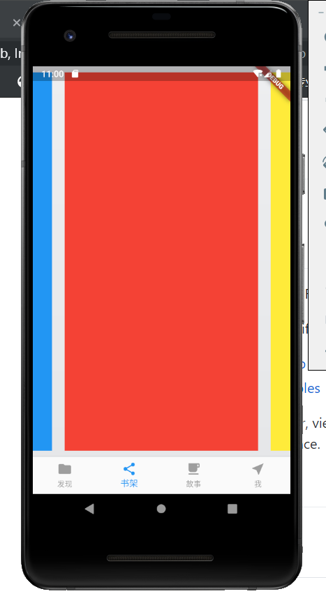

# flutter_app

A new Flutter application.

## Getting Started

This project is a starting point for a Flutter application.

A few resources to get you started if this is your first Flutter project:

- [Lab: Write your first Flutter app](https://flutter.dev/docs/get-started/codelab)
- [Cookbook: Useful Flutter samples](https://flutter.dev/docs/cookbook)

For help getting started with Flutter, view our
[online documentation](https://flutter.dev/docs), which offers tutorials,
samples, guidance on mobile development, and a full API reference.

## dart

[dart教程](https://flutterchina.club/bootstrap-into-dart/)

[获取依赖 pub.dartlang.org/](pub.dartlang.org/)

[json 转 dart 类](https://javiercbk.github.io/json_to_dart/)

[json在线解析](https://app.quicktype.io/)

## choco https://chocolatey.org/install

## ireader 

ireader like weichat reader

viewpager+tab切换

